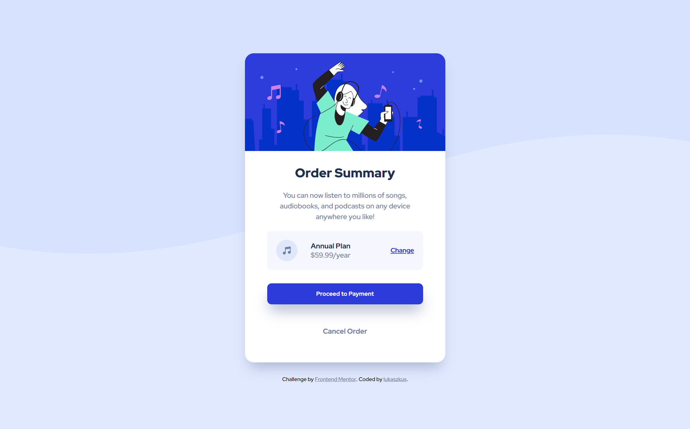

# Frontend Mentor - 3-column preview card component solution

This is a solution to the [Order summary card challenge on Frontend Mentor](https://www.frontendmentor.io/challenges/order-summary-component-QlPmajDUj).

## Table of contents

- [Overview](#overview)
  - [The challenge](#the-challenge)
  - [Screenshot](#screenshot)
  - [Links](#links)
- [My process](#my-process)
  - [Built with](#built-with)
- [Author](#author)

## Overview

### The challenge

Users should be able to:

- See hover states for interactive elements

### Screenshot

### Links

- Solution URL: [https://www.frontendmentor.io/solutions/css-custom-properties-css-flexbox-css-grid-xOljzZQUJ](https://www.frontendmentor.io/solutions/css-custom-properties-css-flexbox-css-grid-xOljzZQUJ)
- Live Site URL: [https://lukaszkus.github.io/3-column-component/](https://lukaszkus.github.io/3-column-component/)

## My process

### Built with

- Semantic HTML5 markup
- [Sass](https://sass-lang.com/) - CSS extension
- BEM methodology
- Flexbox
- Mobile-first workflow
- [Gulp](https://gulpjs.com/) - Task runner

## Author

- Frontend Mentor - [@lukaszkus](https://www.frontendmentor.io/profile/lukaszkus)
